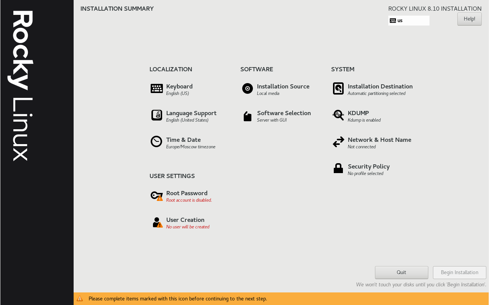
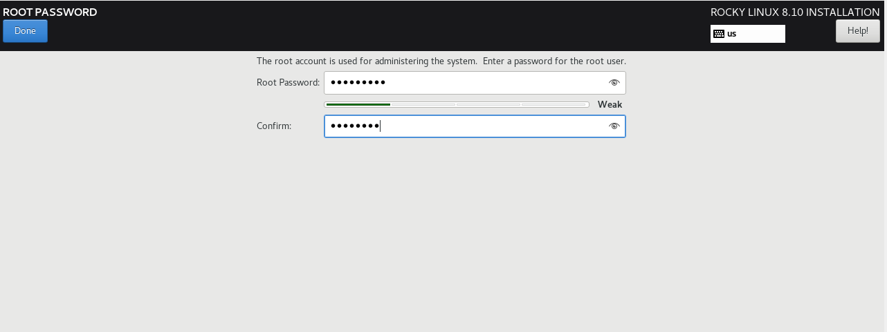
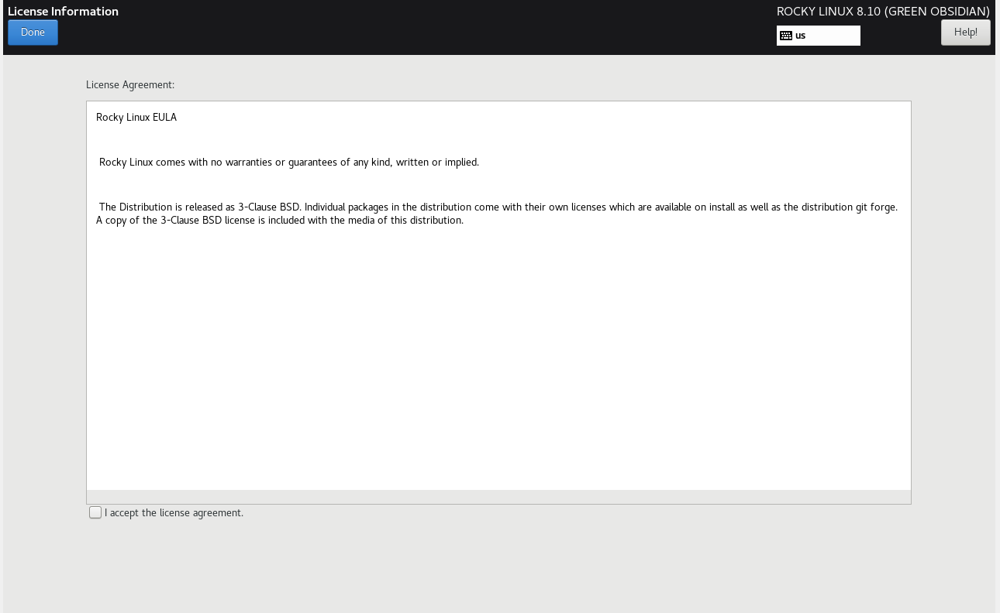
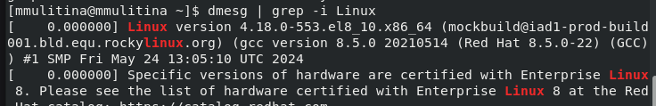
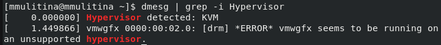

---
## Front matter
lang: ru-RU
title: Лабораторная работа №1
subtitle: НКАбд-01-23
author:
  - Улитина М.М.
institute:
  - Российский университет дружбы народов, Москва, Россия
date: 22 февраля 2025

## i18n babel
babel-lang: russian
babel-otherlangs: english

## Formatting pdf
toc: false
toc-title: Содержание
slide_level: 2
aspectratio: 169
section-titles: true
theme: metropolis
header-includes:
 - \metroset{progressbar=frametitle,sectionpage=progressbar,numbering=fraction}
---

# Информация

## Докладчик

:::::::::::::: {.columns align=center}
::: {.column width="70%"}

  * Улитина Мария Максимовна
  * студентка группы НКАбд-01-23
:::
::: {.column width="30%"}

:::
::::::::::::::

# Вводная часть

## Цель работы

Целью данной работы является приобретение практических навыков
установки операционной системы на виртуальную машину, настройки минимально необходимых для дальнейшей работы сервисов.

# Выполнение лабораторной работы

## Начнем с создания виртуальной машины в Virtual Box

(рис. [-@fig:001]).

{#fig:001 width=70%}

## Выделим необходимые ресурсы

(рис. [-@fig:002]).

{#fig:002 width=70%}

## Выделим необходимые ресурсы

(рис. [-@fig:003]).

{#fig:003 width=70%}

## Запустим виртуальную машину и начнем установку Rocky. Выберем язык 

(рис. [-@fig:005]).

{#fig:005 width=70%}

## Продолжим настройку системы 

(рис. [-@fig:007]).

{#fig:007 width=70%}

## Настроим конфигурацию сети 

(рис. [-@fig:009]).

{#fig:009 width=70%}

## Создадим пароль для root 

(рис. [-@fig:010]).

{#fig:010 width=70%}

## Завершим установку и перезагрузим машину. Примем лицензию 

(рис. [-@fig:012]).

{#fig:012 width=70%}

## Поработаем с командой dmesg 

(рис. [-@fig:015]).

{#fig:015 width=70%}

## Посмотрим версию ОС 

(рис. [-@fig:016]).

{#fig:016 width=70%}

## Информацию о процессере 

(рис. [-@fig:017]).

{#fig:017 width=70%}

## Информацию о оперативной памяти 

{#fig:019 width=70%}

## Информацию о гипервизоре 

(рис. [-@fig:020]).

{#fig:020 width=70%}

## Информацию о файловой системе 

(рис. [-@fig:021]).

{#fig:021 width=70%}

## Информация о последовательности монтирования файловой системы 

(рис. [-@fig:022]).

{#fig:022 width=70%}

## Выводы
 
В процессе выполнения лабораторной работы установила операционную систему на виртуальную машину, настроила минимально необходимые для дальнейшей работы сервисы.

