---
## Front matter
lang: ru-RU
title: Лабораторная работа №2
subtitle: НКАбд-01-23
author:
  - Улитина М.М.
institute:
  - Российский университет дружбы народов, Москва, Россия
date: 8 марта 2025

## i18n babel
babel-lang: russian
babel-otherlangs: english

## Formatting pdf
toc: false
toc-title: Содержание
slide_level: 2
aspectratio: 169
section-titles: true
theme: metropolis
header-includes:
 - \metroset{progressbar=frametitle,sectionpage=progressbar,numbering=fraction}
---

# Информация

## Докладчик

:::::::::::::: {.columns align=center}
::: {.column width="70%"}

  * Улитина Мария Максимовна
  * студентка группы НКАбд-01-23
:::
::: {.column width="30%"}

:::
::::::::::::::

# Вводная часть

## Цель работы

Получение практических навыков работы в консоли с атрибутами файлов, закрепление теоретических основ дискреционного разграничения доступа в современных системах с открытым кодом на базе ОС Linux.

# Выполнение лабораторной работы

# Выполнение лабораторной работы

## Создаем пользователя guest и пароль дня него

(рис. [-@fig:001]).

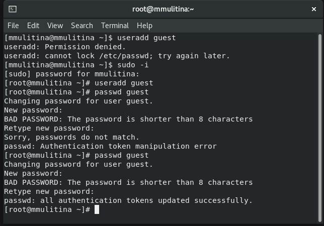{#fig:001 width=70%}

## Посмотрим, где мы находимся с помощью pwd

(рис. [-@fig:002]).

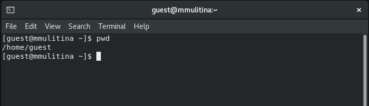{#fig:002 width=70%}

## Спросим, кто мы с whoami

(рис. [-@fig:003]).

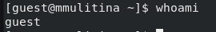{#fig:003 width=70%}

## Выведем команду id

(рис. [-@fig:004]).

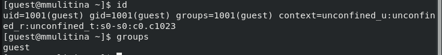{#fig:004 width=70%}

## Посмотрим файл с паролями

(рис. [-@fig:005]).

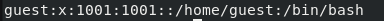{#fig:005 width=70%}

## Определим дректории с ls

(рис. [-@fig:006]).

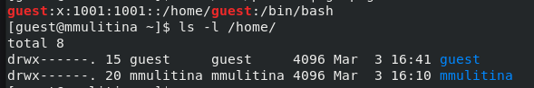{#fig:006 width=70%}

## Запросим атрибуты с lsattr

(рис. [-@fig:007]).

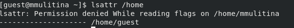{#fig:007 width=70%}

## Создадим каталог dir1, посмотрим права доступа

(рис. [-@fig:008]).

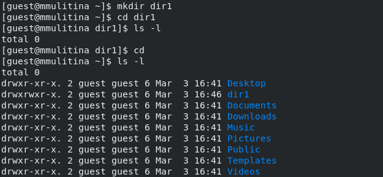{#fig:008 width=70%}

(рис. [-@fig:009]).

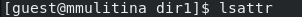{#fig:009 width=70%}

## Снимем все аттрибуты с dir1

(рис. [-@fig:010]).

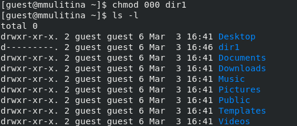{#fig:010 width=70%}

## Попробуем внести изменения в dir1 

(рис. [-@fig:011]).

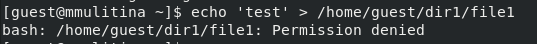{#fig:011 width=70%}

## Попробуем перейти в dir1

(рис. [-@fig:012]).

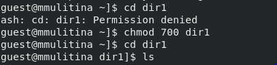{#fig:012 width=70%}

## Выводы
 
В процессе выполнения лабораторной работы создала необходимых пользователей и поработала с каталогами и правами доступа.

