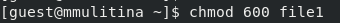

---
## Front matter
lang: ru-RU
title: Лабораторная работа №4
subtitle: НКАбд-01-23
author:
  - Улитина М.М.
institute:
  - Российский университет дружбы народов, Москва, Россия
date: 5 апреля 2025

## i18n babel
babel-lang: russian
babel-otherlangs: english

## Formatting pdf
toc: false
toc-title: Содержание
slide_level: 2
aspectratio: 169
section-titles: true
theme: metropolis
header-includes:
 - \metroset{progressbar=frametitle,sectionpage=progressbar,numbering=fraction}
---

# Информация

## Докладчик

:::::::::::::: {.columns align=center}
::: {.column width="70%"}

  * Улитина Мария Максимовна
  * студентка группы НКАбд-01-23
:::
::: {.column width="30%"}

:::
::::::::::::::

# Вводная часть

## Цель работы

Получение практических навыков работы в консоли с расширенными атрибутами файлов.

# Выполнение лабораторной работы

## Поработаем с командой lsattr

(рис. [-@fig:001]).

{#fig:001 width=70%}

## Поработаем с командой chmod

(рис. [-@fig:002]).

{#fig:002 width=70%}

## Через root поработаем с chattr +a/-a/+i/-i 

(рис. [-@fig:003]).

{#fig:003 width=70%}

## Поработаем с файлом 

(рис. [-@fig:004]).

{#fig:004 width=70%}

## Произведем различные действия с файлом до и после изменения chattr 

(рис. [-@fig:005]).

{#fig:005 width=70%}

## Выводы
 
В процессе выполнения лабораторной работы я получила практические навыки работы c атрибутами файлов.

