---
## Front matter
title: "Лабораторная работа №1"
subtitle: "НКАбд-01-23"
author: "Улитина Мария Максимовна"

## Generic otions
lang: ru-RU
toc-title: "Содержание"

## Pdf output format
toc: true # Table of contents
toc-depth: 2
lof: true # List of figures
lot: true # List of tables
fontsize: 12pt
linestretch: 1.5
papersize: a4
documentclass: scrreprt
## I18n polyglossia
polyglossia-lang:
  name: russian
  options:
	- spelling=modern
	- babelshorthands=true
polyglossia-otherlangs:
  name: english
## I18n babel
babel-lang: russian
babel-otherlangs: english
## Fonts
mainfont: IBM Plex Serif
romanfont: IBM Plex Serif
sansfont: IBM Plex Sans
monofont: IBM Plex Mono
mathfont: STIX Two Math
mainfontoptions: Ligatures=Common,Ligatures=TeX,Scale=0.94
romanfontoptions: Ligatures=Common,Ligatures=TeX,Scale=0.94
sansfontoptions: Ligatures=Common,Ligatures=TeX,Scale=MatchLowercase,Scale=0.94
monofontoptions: Scale=MatchLowercase,Scale=0.94,FakeStretch=0.9
mathfontoptions:
## Biblatex
biblatex: true
biblio-style: "gost-numeric"
biblatexoptions:
  - parentracker=true
  - backend=biber
  - hyperref=auto
  - language=auto
  - autolang=other*
  - citestyle=gost-numeric
## Pandoc-crossref LaTeX customization
figureTitle: "Рис."
tableTitle: "Таблица"
listingTitle: "Листинг"
lofTitle: "Список иллюстраций"
lotTitle: "Список таблиц"
lolTitle: "Листинги"
## Misc options
indent: true
header-includes:
  - \usepackage{indentfirst}
  - \usepackage{float} # keep figures where there are in the text
  - \floatplacement{figure}{H} # keep figures where there are in the text
---

# Цель работы

Целью данной работы является приобретение практических навыков
установки операционной системы на виртуальную машину, настройки минимально необходимых для дальнейшей работы сервисов.

# Задание

Настройка виртуальной машины, установка и настройка ОС Rocky Linux.

# Выполнение лабораторной работы

Начнем с создания виртуальной машины в Virtual Box(рис. [-@fig:001]).

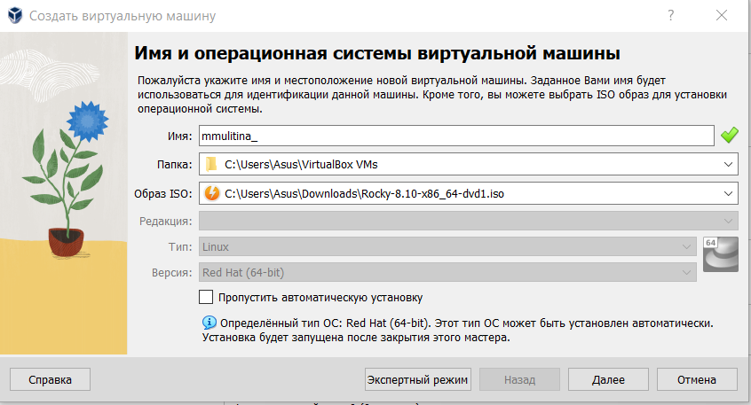{#fig:001 width=70%}

Выделим необходимые ресурсы(рис. [-@fig:002]).

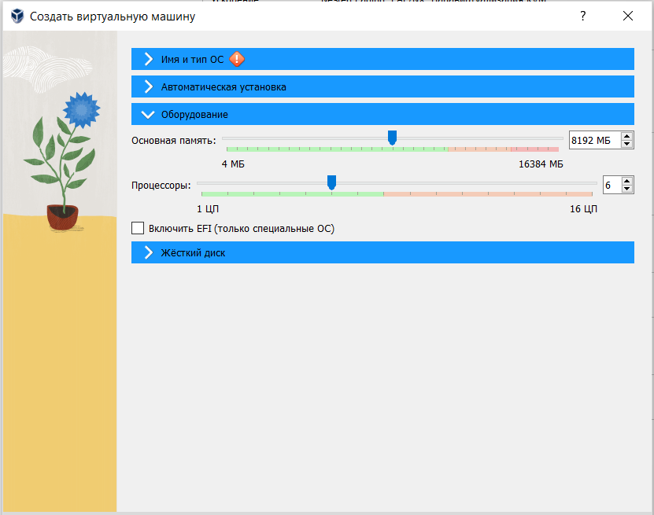{#fig:002 width=70%}

Выделим необходимые ресурсы(рис. [-@fig:003]).

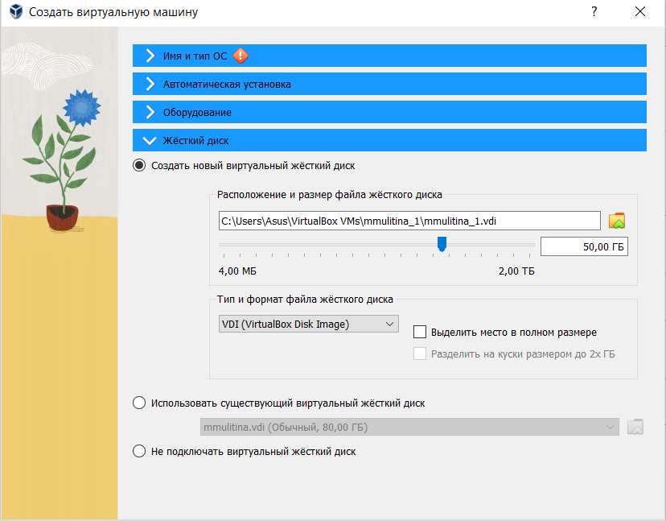{#fig:003 width=70%}

Добавим образ диска ОС(рис. [-@fig:004]).

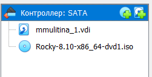{#fig:004 width=70%}

Запустим виртуальную машину и начнем установку Rocky. Выберем язык (рис. [-@fig:005]).

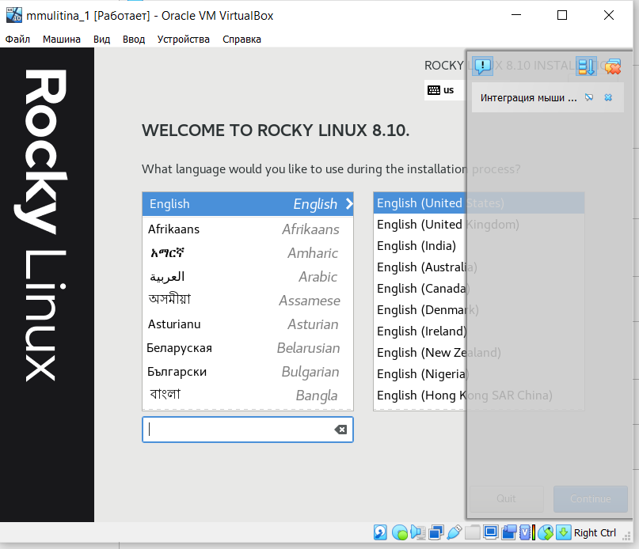{#fig:005 width=70%}

Установим регион и часовой пояс (рис. [-@fig:006]).

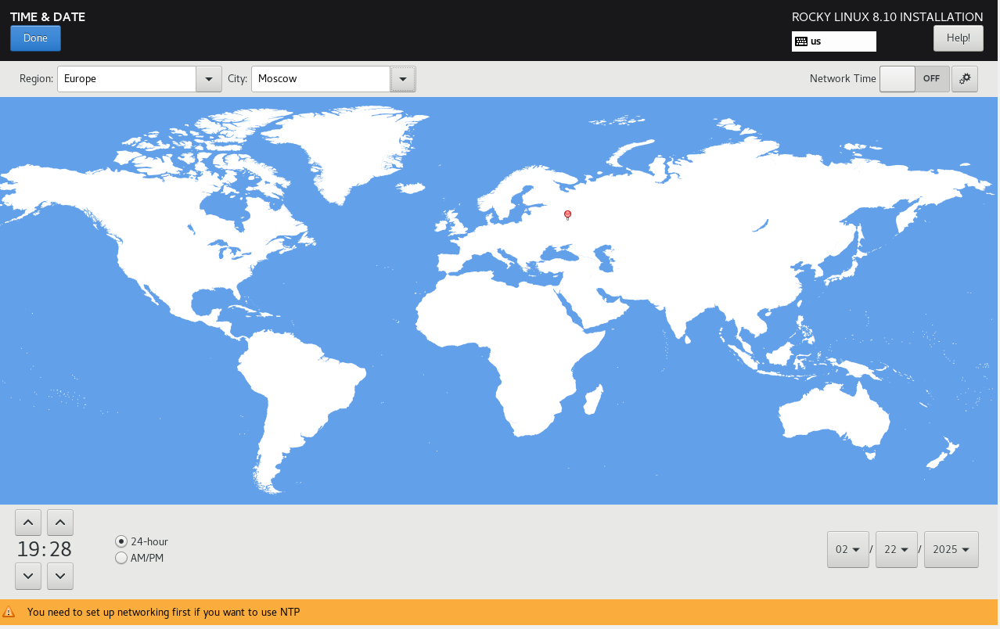{#fig:006 width=70%}

Продолжим настройку системы (рис. [-@fig:007]).

{#fig:007 width=70%}

Подключим Development tools (рис. [-@fig:008]).

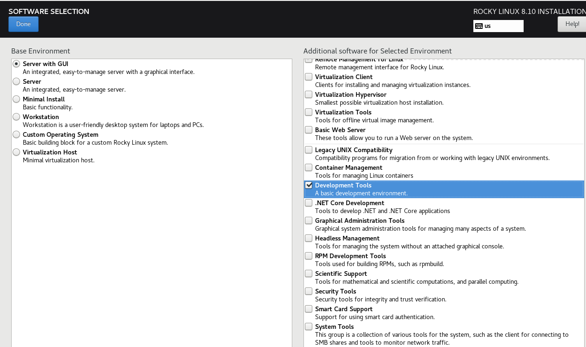{#fig:008 width=70%}

Настроим конфигурацию сети (рис. [-@fig:009]).

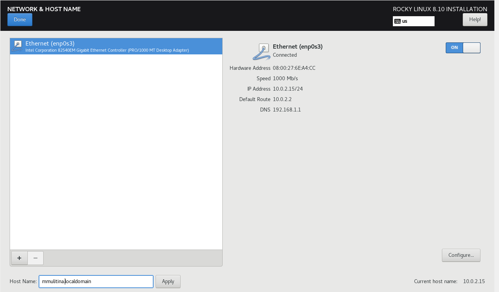{#fig:009 width=70%}

Создадим пароль для root (рис. [-@fig:010]).

{#fig:010 width=70%}

Создадим профиль и выберем пароль для него (рис. [-@fig:011]).

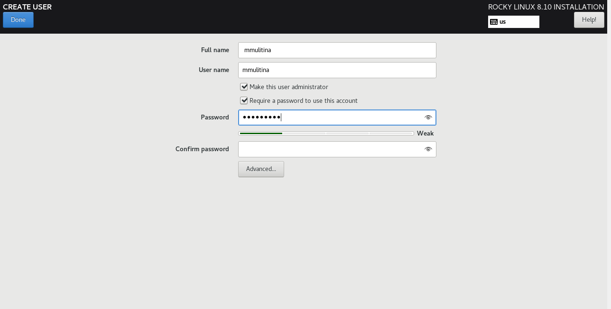{#fig:011 width=70%}

Завершим установку и перезагрузим машину. Примем лицензию (рис. [-@fig:012]).

{#fig:012 width=70%}

Войдем в свой профиль (рис. [-@fig:013]).

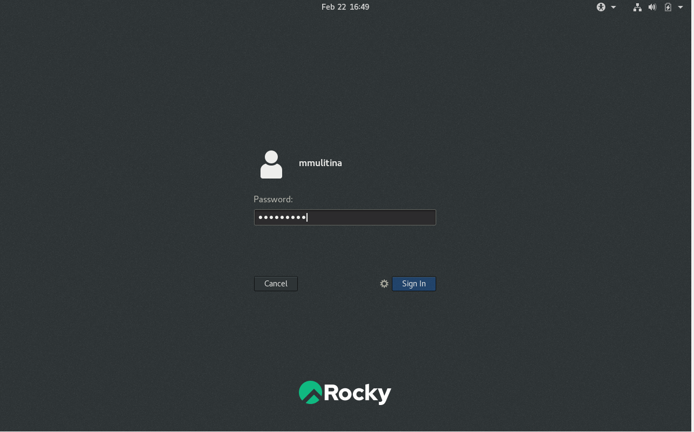{#fig:013 width=70%}

Подключим дополнительную ОС (рис. [-@fig:014]).

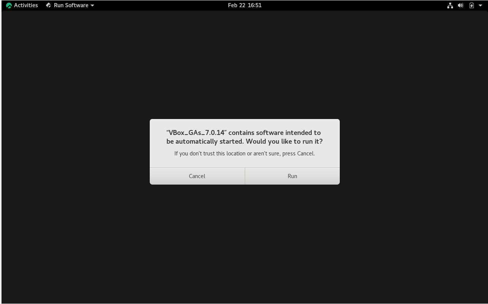{#fig:014 width=70%}

Поработаем с командой dmesg (рис. [-@fig:015]).

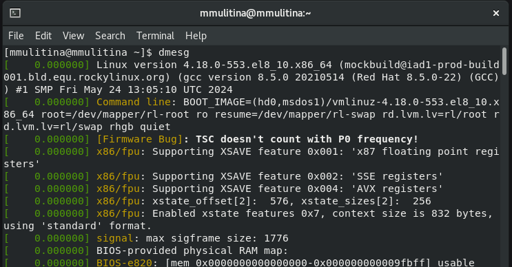{#fig:015 width=70%}

Посмотрим версию ОС (рис. [-@fig:016]).

{#fig:016 width=70%}

Информацию о процессере (рис. [-@fig:017]).

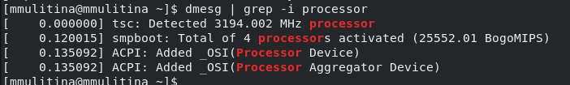{#fig:017 width=70%}

 (рис. [-@fig:018]).

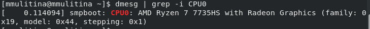{#fig:018 width=70%}

Информацию о оперативной памяти (рис. [-@fig:019]).

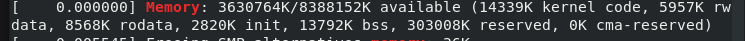{#fig:019 width=70%}

Информацию о гипервизоре (рис. [-@fig:020]).

{#fig:020 width=70%}

Информацию о файловой системе (рис. [-@fig:021]).

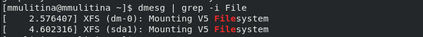{#fig:021 width=70%}

Информация о последовательности монтирования файловой системы (рис. [-@fig:022]).

{#fig:022 width=70%}

# Контрольные вопросы

1. Его имя и его файлы.

2. Справка - man, пример man ls. Перемещение cd, пример - cd Downloads. Просмотр содержимого каталога ls, пример - ls Documents. Для определения объёма каталога df, пример df -h. Создание каталога mkdir, удаление rm, создание файла touch, пример - mkdir work. Задание прав chmod, например chmod --x filename. Для просмотра истории команд history.

3. Файловая система - порядок, определяющий способ организации, хранения и именования данных на носителях информации в компьютерах, а также в другом электронном оборудовании.

4. С помощью команды mount.

5. С помощью команды kill.

# Выводы

В процессе выполнения лабораторной работы установила операционную систему на виртуальную машину, настроила минимально необходимые для дальнейшей работы сервисы.

# Список литературы{.unnumbered}

1. Лабораторная работа №1, ТУИС РУДН.
