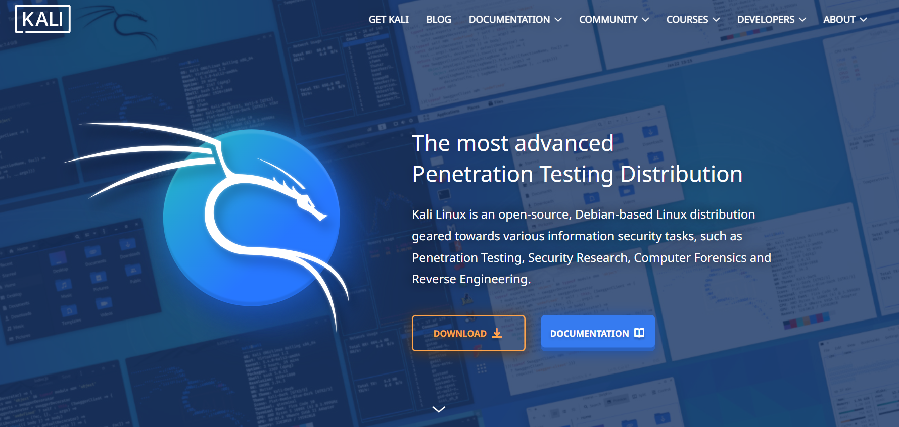
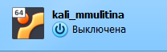
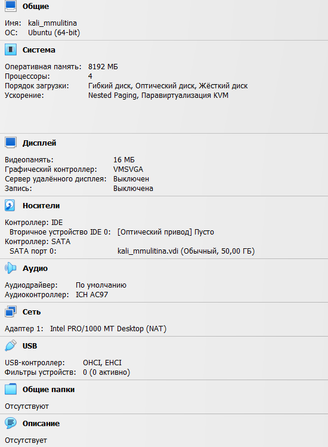
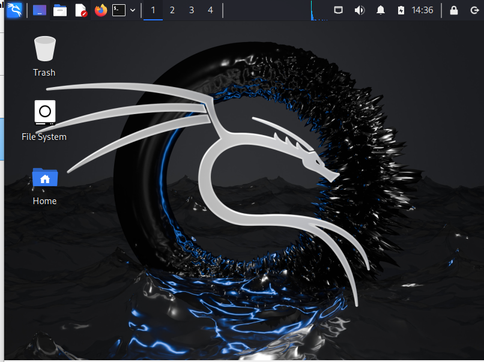

---
## Front matter
lang: ru-RU
title: Индивидуальный проект. Этап 1.
subtitle: НКАбд-01-23
author:
  - Улитина М.М.
institute:
  - Российский университет дружбы народов, Москва, Россия
date: 8 марта 2025

## i18n babel
babel-lang: russian
babel-otherlangs: english

## Formatting pdf
toc: false
toc-title: Содержание
slide_level: 2
aspectratio: 169
section-titles: true
theme: metropolis
header-includes:
 - \metroset{progressbar=frametitle,sectionpage=progressbar,numbering=fraction}
---

# Информация

## Докладчик

:::::::::::::: {.columns align=center}
::: {.column width="70%"}

  * Улитина Мария Максимовна
  * студентка группы НКАбд-01-23
:::
::: {.column width="30%"}

:::
::::::::::::::

# Вводная часть

## Цель работы

Установка Kali Linux.

# Выполнение лабораторной работы

## Заходим на сайт kali, чтобы установить образ

(рис. [-@fig:001]).

{#fig:001 width=70%}

## Скачиваем

(рис. [-@fig:002]).

{#fig:002 width=70%}

## Настраиваем ВМ

(рис. [-@fig:003]).

{#fig:003 width=70%}

(рис. [-@fig:004]).

{#fig:004 width=70%}

## Настраиваем систему, проходим все шаги установки и получаем kali 

(рис. [-@fig:005]).

{#fig:005 width=70%}

## Выводы
 
В процессе выполнения лабораторной работы установили Kali.

