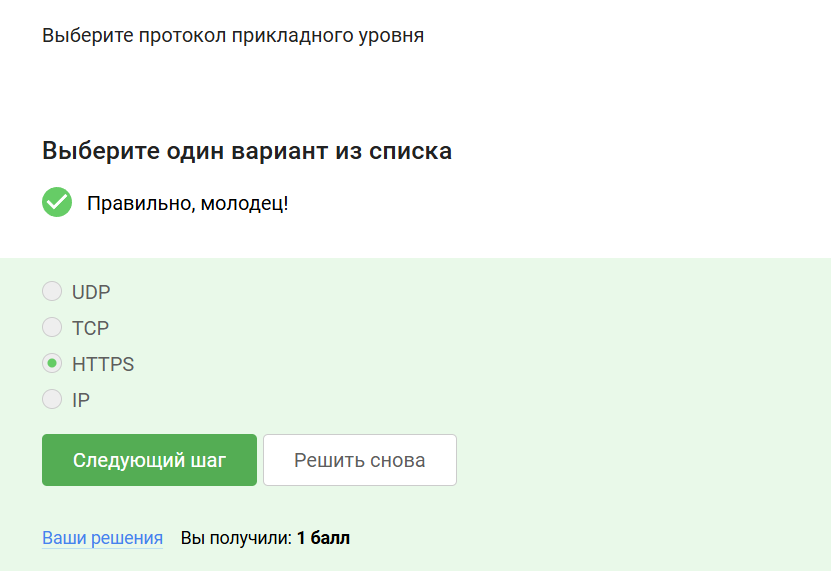
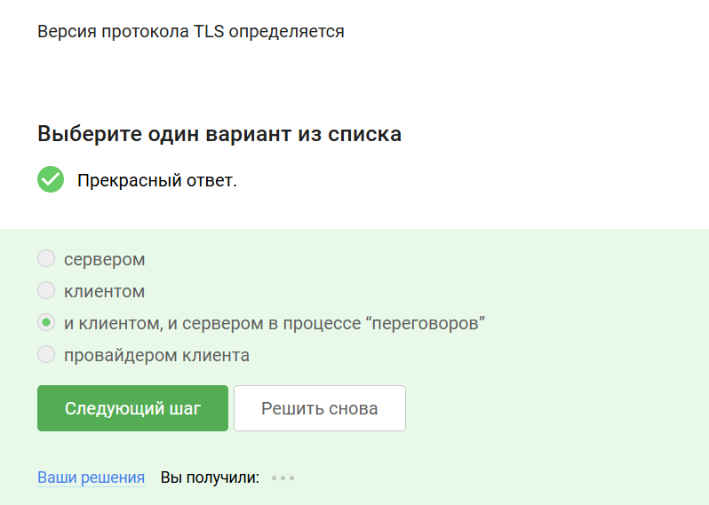
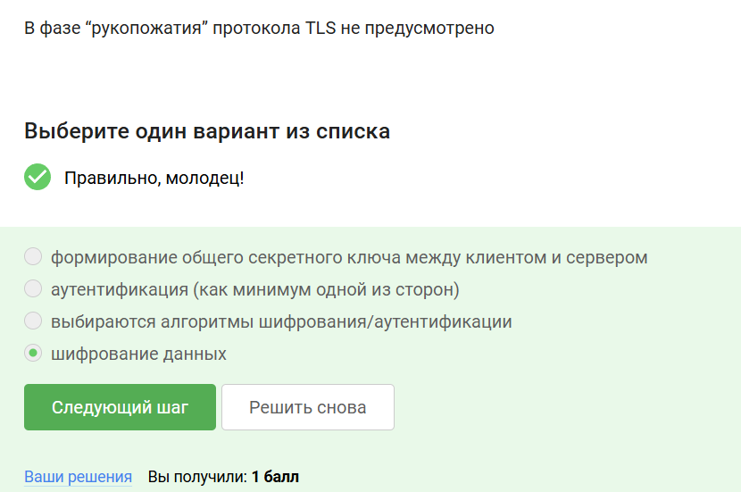
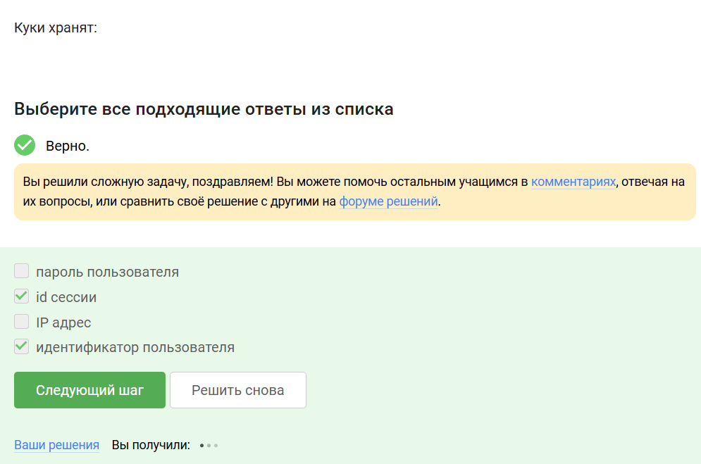
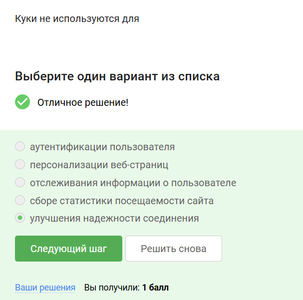
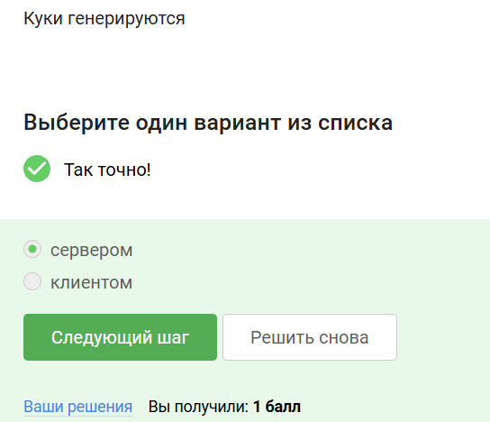
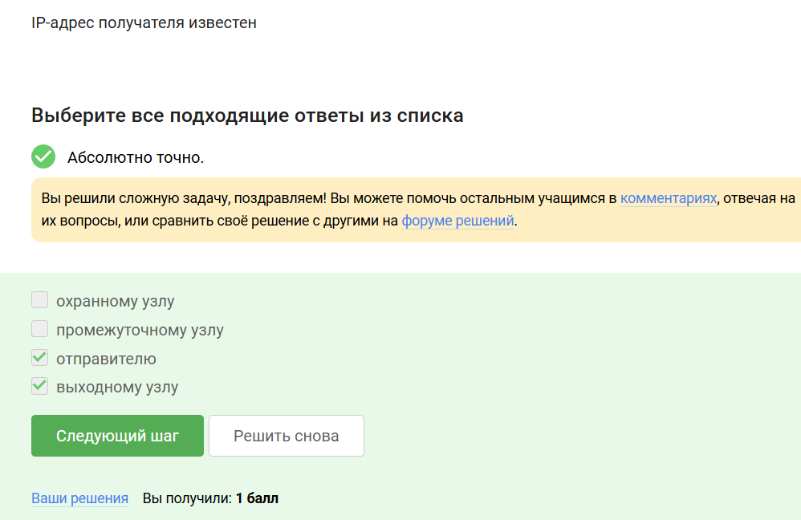
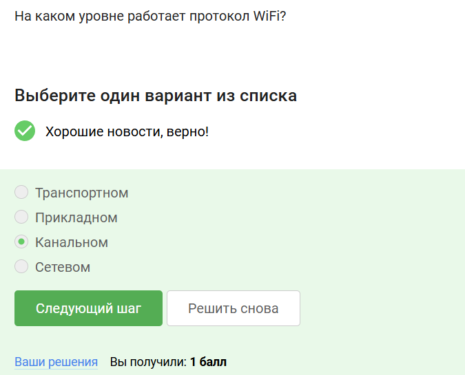

---
## Front matter
title: Этап1
subtitle: НКАбд-01-23
author: Улитина Мария Максимовна

## Generic otions
lang: ru-RU
toc-title: "Содержание"

## Bibliography
bibliography: bib/cite.bib
csl: pandoc/csl/gost-r-7-0-5-2008-numeric.csl

## Pdf output format
toc: true # Table of contents
toc-depth: 2
lof: true # List of figures
lot: true # List of tables
fontsize: 12pt
linestretch: 1.5
papersize: a4
documentclass: scrreprt
## I18n polyglossia
polyglossia-lang:
  name: russian
  options:
	- spelling=modern
	- babelshorthands=true
polyglossia-otherlangs:
  name: english
## I18n babel
babel-lang: russian
babel-otherlangs: english
## Fonts
mainfont: IBM Plex Serif
romanfont: IBM Plex Serif
sansfont: IBM Plex Sans
monofont: IBM Plex Mono
mathfont: STIX Two Math
mainfontoptions: Ligatures=Common,Ligatures=TeX,Scale=0.94
romanfontoptions: Ligatures=Common,Ligatures=TeX,Scale=0.94
sansfontoptions: Ligatures=Common,Ligatures=TeX,Scale=MatchLowercase,Scale=0.94
monofontoptions: Scale=MatchLowercase,Scale=0.94,FakeStretch=0.9
mathfontoptions:
## Biblatex
biblatex: true
biblio-style: "gost-numeric"
biblatexoptions:
  - parentracker=true
  - backend=biber
  - hyperref=auto
  - language=auto
  - autolang=other*
  - citestyle=gost-numeric
## Pandoc-crossref LaTeX customization
figureTitle: "Рис."
tableTitle: "Таблица"
listingTitle: "Листинг"
lofTitle: "Список иллюстраций"
lotTitle: "Список таблиц"
lolTitle: "Листинги"
## Misc options
indent: true
header-includes:
  - \usepackage{indentfirst}
  - \usepackage{float} # keep figures where there are in the text
  - \floatplacement{figure}{H} # keep figures where there are in the text
---

# Выполнение первого этапа внешнего курса

HTTPS - протокол прикладного уровня (рис. [-@fig:001]).

{#fig:001 width=70%}

TCP - протокол транспортного уровня (рис. [-@fig:002]).

{#fig:002 width=70%}

225 и меньше (рис. [-@fig:003]).

{#fig:003 width=70%}

DNS сервер сопоставляет IP адреса доменным именам (рис. [-@fig:004]).

{#fig:004 width=70%}

Последовательность протоколов (рис. [-@fig:005]).

{#fig:005 width=70%}

http передает в открытом виде (рис. [-@fig:006]).

{#fig:006 width=70%}

HTTPS состоит из двух фаз (рис. [-@fig:007]).

{#fig:007 width=70%}

Версия TLS определяется и клиентом, и сервером (рис. [-@fig:008]).

{#fig:008 width=70%}

Шифрование данных не предусмотрено (рис. [-@fig:009]).

{#fig:009 width=70%}

Куки хранит id сессии и идентификатор пользователя (рис. [-@fig:010]).

{#fig:010 width=70%}

Куки НЕ используется для улучшени надежности соединения (рис. [-@fig:011]).

{#fig:011 width=70%}

Куки генерируются сервером  (рис. [-@fig:012]).

{#fig:012 width=70%}

Сессионные куки хранятся в браузере на время пользования веб сайтом (рис. [-@fig:013]).

{#fig:013 width=70%}

ТОР имеет 3 промежуточных узла (рис. [-@fig:014]).

{#fig:014 width=70%}

IP адрес получателя известен отправителю и выходному узлу (рис. [-@fig:015]).

{#fig:015 width=70%}

Отправитель генерирует общий секретный ключ с охранным, промежуточным и выходным узлом (рис. [-@fig:016]).

{#fig:016 width=70%}

Нет, не должен (рис. [-@fig:017]).

{#fig:017 width=70%}

Wi-Fi технология (рис. [-@fig:018]).

{#fig:018 width=70%}

Работает на канальном уровне (рис. [-@fig:019]).

{#fig:019 width=70%}

WEP - небезопасный метод (рис. [-@fig:020]).

{#fig:020 width=70%}

Данные передаются в зашифрованном виде (рис. [-@fig:021]).

{#fig:021 width=70%}

Для домашней сети (рис. [-@fig:022]).

{#fig:022 width=70%}

# Выводы

Выволнен первый этап.

