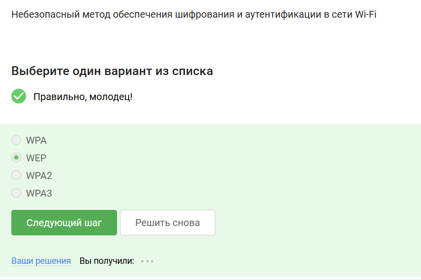

---
## Front matter
lang: ru-RU
title:Этап 1.
subtitle: Внешний курс.
author:
  - Улитина М.М.
institute:
  - Российский университет дружбы народов, Москва, Россия

date: 17 мая 2025

## i18n babel
babel-lang: russian
babel-otherlangs: english

## Formatting pdf
toc: false
toc-title: Содержание
slide_level: 2
aspectratio: 169
section-titles: true
theme: metropolis
header-includes:
 - \metroset{progressbar=frametitle,sectionpage=progressbar,numbering=fraction}
---

# Информация

## Докладчик

:::::::::::::: {.columns align=center}
::: {.column width="70%"}

  * Улитина Мария Максимовна
  * Российский университет дружбы народов

# Выполнение первого этапа внешнего курса

## HTTPS - протокол прикладного уровня

## TCP - протокол транспортного уровня

## 225 и меньше

## DNS сервер сопоставляет IP адреса доменным именам 

## Последовательность протоколов 

## http передает в открытом виде

## HTTPS состоит из двух фаз

## Версия TLS определяется и клиентом, и сервером

## Шифрование данных не предусмотрено

## Куки хранит id сессии и идентификатор пользователя

## Куки НЕ используется для улучшени надежности соединения

## Куки генерируются сервером 

## Сессионные куки хранятся в браузере на время пользования веб сайтом 

## ТОР имеет 3 промежуточных узла 

## IP адрес получателя известен отправителю и выходному узлу

## Отправитель генерирует общий секретный ключ с охранным, промежуточным и выходным узлом 

## Нет, не должен 

## Wi-Fi технология

## Работает на канальном уровне 

## WEP - небезопасный метод 

## Данные передаются в зашифрованном виде 

## Для домашней сети 

# Выводы

Выволнен первый этап.

