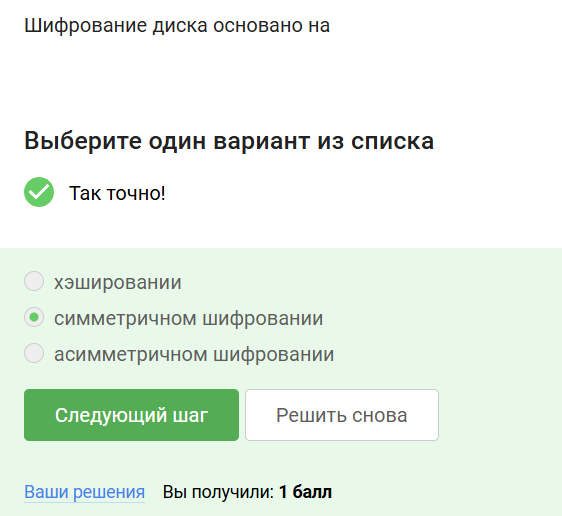
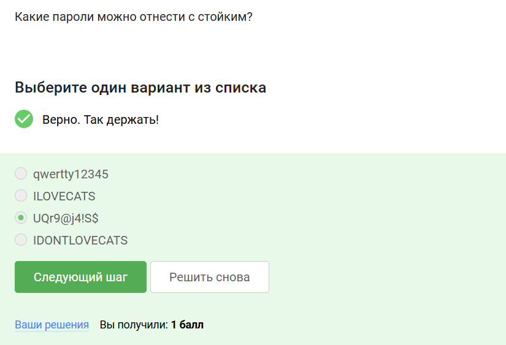
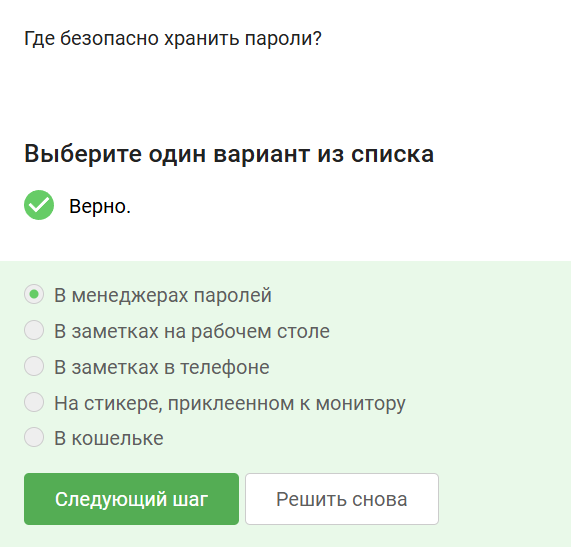
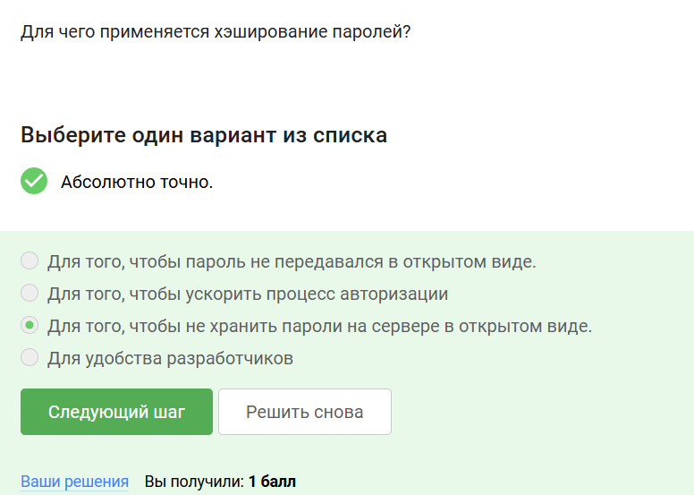
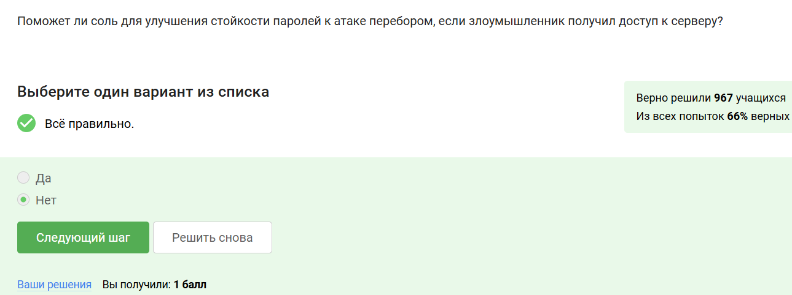
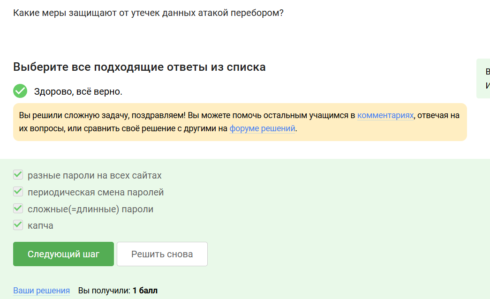
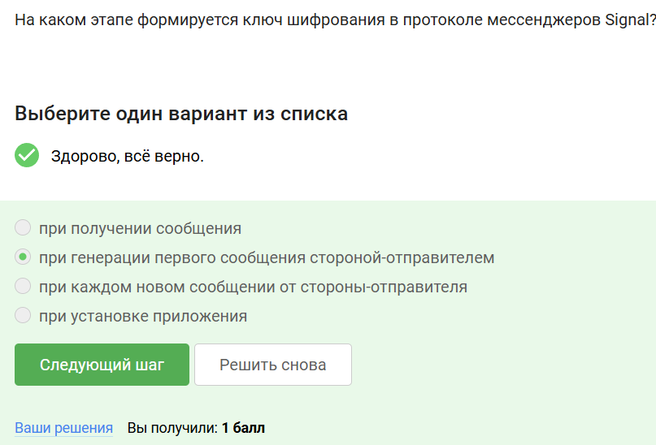
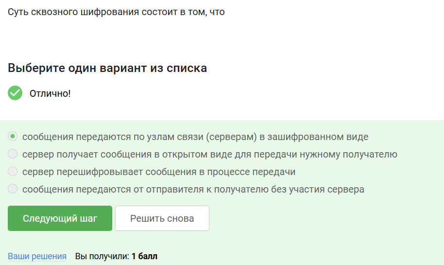

---
## Front matter
title: Этап1
subtitle: НКАбд-01-23
author: Улитина Мария Максимовна

## Generic otions
lang: ru-RU
toc-title: "Содержание"

## Bibliography
bibliography: bib/cite.bib
csl: pandoc/csl/gost-r-7-0-5-2008-numeric.csl

## Pdf output format
toc: true # Table of contents
toc-depth: 2
lof: true # List of figures
lot: true # List of tables
fontsize: 12pt
linestretch: 1.5
papersize: a4
documentclass: scrreprt
## I18n polyglossia
polyglossia-lang:
  name: russian
  options:
	- spelling=modern
	- babelshorthands=true
polyglossia-otherlangs:
  name: english
## I18n babel
babel-lang: russian
babel-otherlangs: english
## Fonts
mainfont: IBM Plex Serif
romanfont: IBM Plex Serif
sansfont: IBM Plex Sans
monofont: IBM Plex Mono
mathfont: STIX Two Math
mainfontoptions: Ligatures=Common,Ligatures=TeX,Scale=0.94
romanfontoptions: Ligatures=Common,Ligatures=TeX,Scale=0.94
sansfontoptions: Ligatures=Common,Ligatures=TeX,Scale=MatchLowercase,Scale=0.94
monofontoptions: Scale=MatchLowercase,Scale=0.94,FakeStretch=0.9
mathfontoptions:
## Biblatex
biblatex: true
biblio-style: "gost-numeric"
biblatexoptions:
  - parentracker=true
  - backend=biber
  - hyperref=auto
  - language=auto
  - autolang=other*
  - citestyle=gost-numeric
## Pandoc-crossref LaTeX customization
figureTitle: "Рис."
tableTitle: "Таблица"
listingTitle: "Листинг"
lofTitle: "Список иллюстраций"
lotTitle: "Список таблиц"
lolTitle: "Листинги"
## Misc options
indent: true
header-includes:
  - \usepackage{indentfirst}
  - \usepackage{float} # keep figures where there are in the text
  - \floatplacement{figure}{H} # keep figures where there are in the text
---

# Выполнение второго этапа внешнего курса

Нет, нельзя (рис. [-@fig:001]).

{#fig:001 width=70%}

Шифрование диска основано на симметричном шифровании (рис. [-@fig:002]).

{#fig:002 width=70%}

Пррограммы, с помощью которых можно зашифровать диск(рис. [-@fig:003]).

{#fig:003 width=70%}

Нет слов, разный регистр, специальные символы(рис. [-@fig:004]).

{#fig:004 width=70%}

Остальные способы небезопасны(рис. [-@fig:005]).

{#fig:005 width=70%}

Для защиты от автоматизированных атак(рис. [-@fig:006]).

{#fig:006 width=70%}

Повышение безопасности(рис. [-@fig:007]).

{#fig:007 width=70%}

Нет, не поможет(рис. [-@fig:008]).

{#fig:008 width=70%}

Все меры помогут(рис. [-@fig:009]).

{#fig:009 width=70%}

Фишинговые ссылки (рис. [-@fig:010]).

{#fig:010 width=70%}

Да, его могли взломать(рис. [-@fig:011]).

{#fig:011 width=70%}

Подмена адреса отправителя(рис. [-@fig:012]).

{#fig:012 width=70%}

Маскируется под легитимную программу(рис. [-@fig:013]).

{#fig:013 width=70%}

При генерации первого сообщения (рис. [-@fig:014]).

{#fig:014 width=70%}

Передается в зашифрованном виде(рис. [-@fig:015]).

{#fig:015 width=70%}

# Выводы

Выволнен второй этап.

