---
## Front matter
lang: ru-RU
title: Этап 2.
subtitle: Внешний курс
author:
  - Улитина М.М.
institute:
  - Российский университет дружбы народов, Москва, Россия

date: 17 мая 2025

## i18n babel
babel-lang: russian
babel-otherlangs: english

## Formatting pdf
toc: false
toc-title: Содержание
slide_level: 2
aspectratio: 169
section-titles: true
theme: metropolis
header-includes:
 - \metroset{progressbar=frametitle,sectionpage=progressbar,numbering=fraction}
---

# Информация

## Докладчик

:::::::::::::: {.columns align=center}
::: {.column width="70%"}

  * Улитина Мария Максимовна
  * студентка
  * Российский университет дружбы народов

# Выполнение второго этапа внешнего курса

## Нет, нельзя

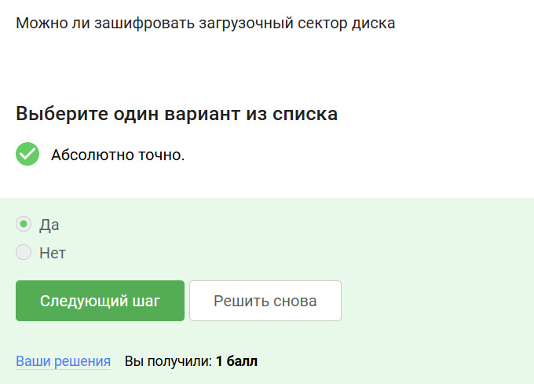

## Шифрование диска основано на симметричном шифровании 

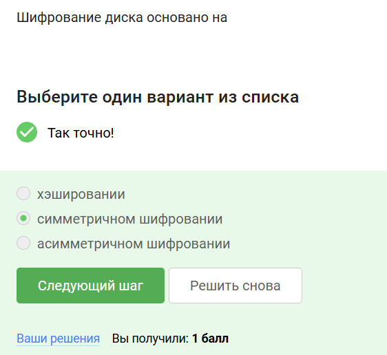

## Программы, с помощью которых можно зашифровать диск

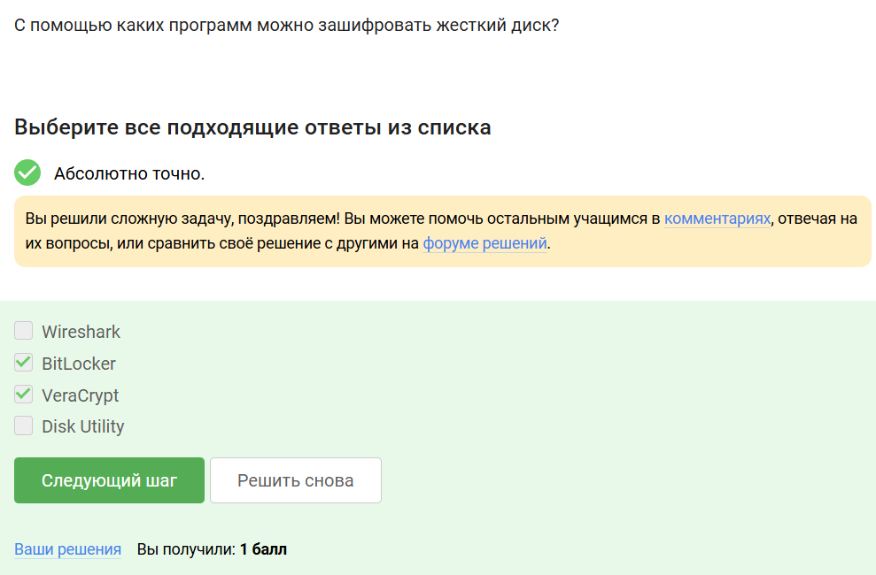

## Нет слов, разный регистр, специальные символы

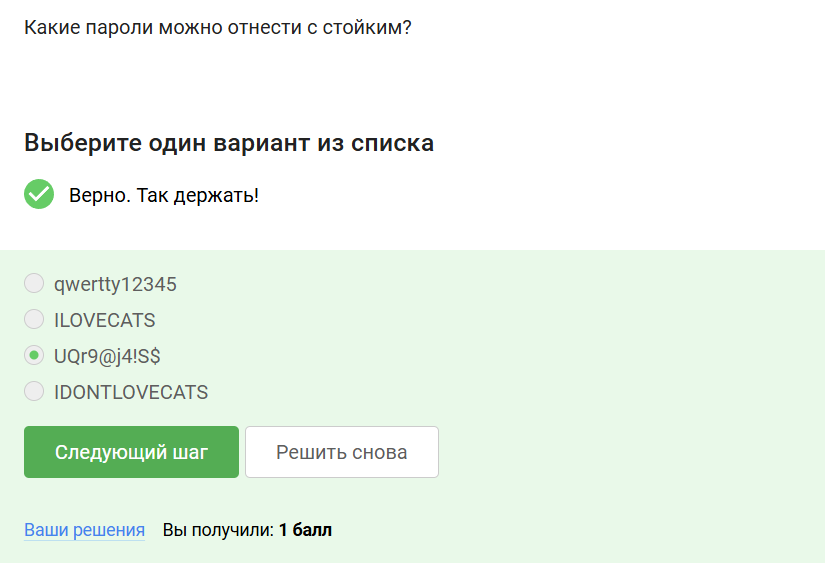

## Остальные способы небезопасны

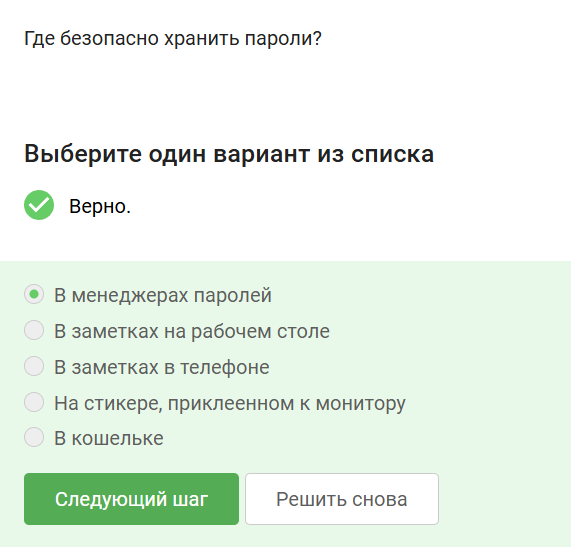

## Для защиты от автоматизированных атак

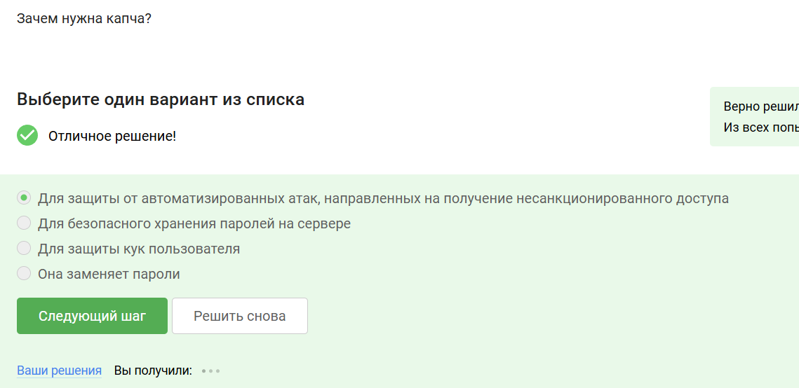

## Повышение безопасности

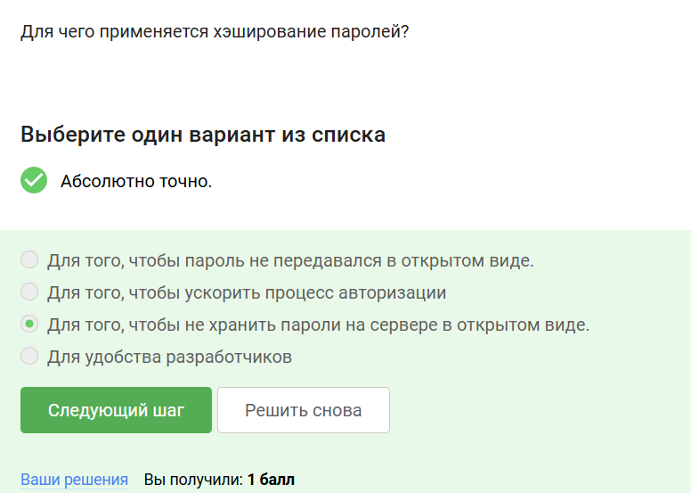

## Нет, не поможет

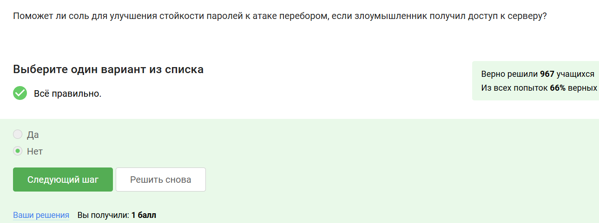

## Все меры помогут

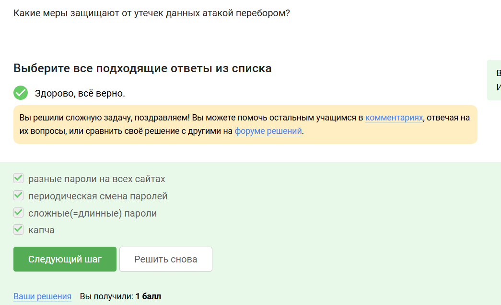

## Фишинговые ссылки

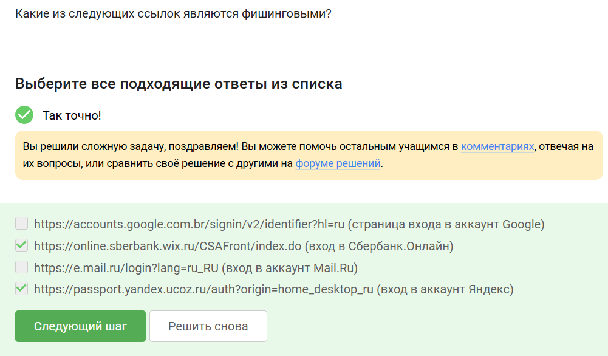

## Да, его могли взломать

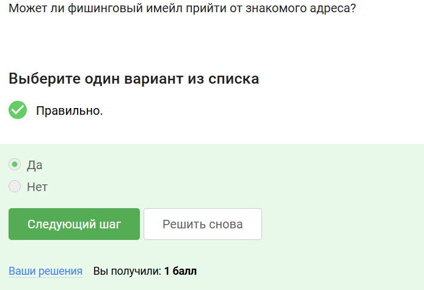

## Подмена адреса отправителя

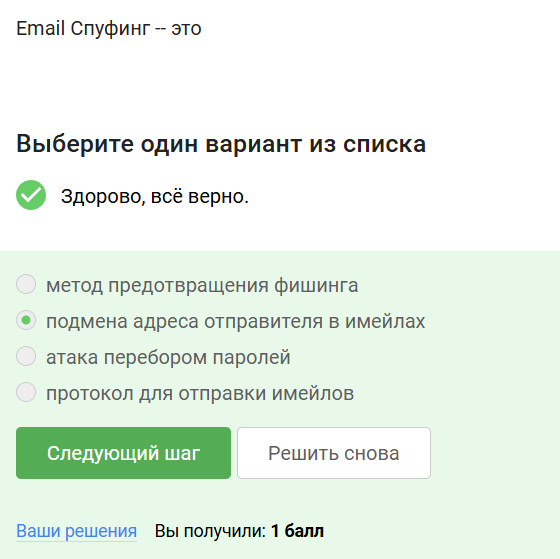{#fig:012 width=70%}

## Маскируется под легитимную программу

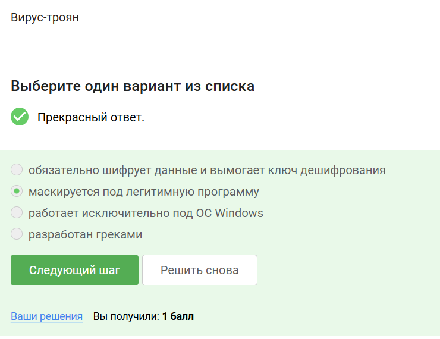

## При генерации первого сообщения 

## Передается в зашифрованном виде

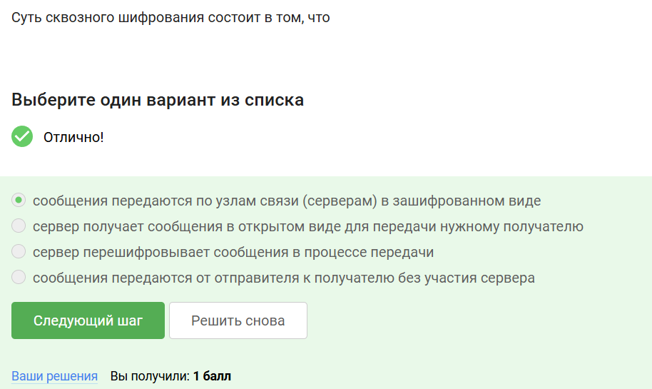

# Выводы

Выволнен второй этап.

