---
## Front matter
lang: ru-RU
title: Этап 3
subtitle: Внешний проект
author:
  - Улитина М.М.
institute:
  - Российский университет дружбы народов, Москва, Россия

date: 17 мая 2025

## i18n babel
babel-lang: russian
babel-otherlangs: english

## Formatting pdf
toc: false
toc-title: Содержание
slide_level: 2
aspectratio: 169
section-titles: true
theme: metropolis
header-includes:
 - \metroset{progressbar=frametitle,sectionpage=progressbar,numbering=fraction}
---

# Информация

## Докладчик

:::::::::::::: {.columns align=center}
::: {.column width="70%"}

  * Улитина Мария Максимовна
  * студентка

# Выполнение второго этапа внешнего курса

## Имеют пару ключей 

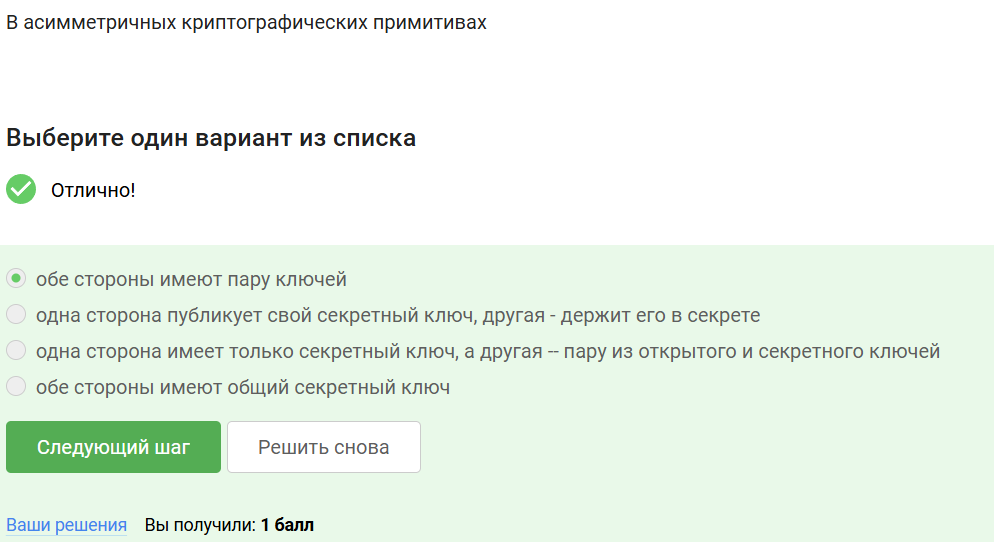

## Свойсва хэш-функции

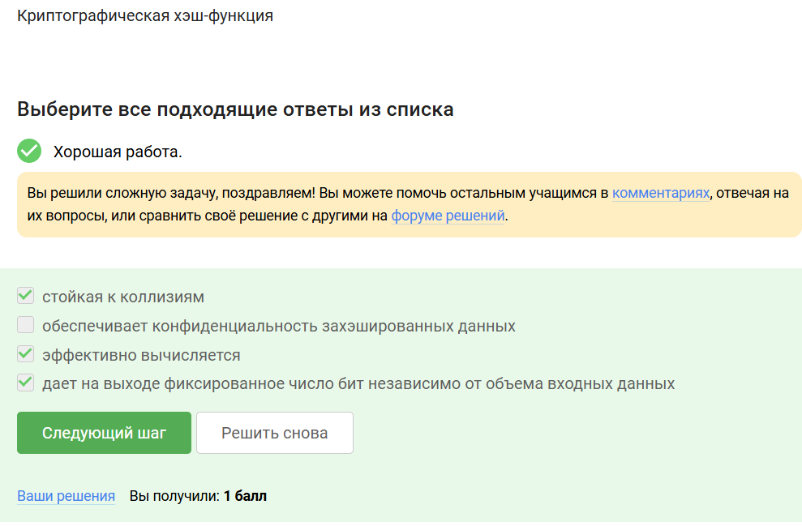

## Алгоритмы цифровой функции 

## Код аутентификации

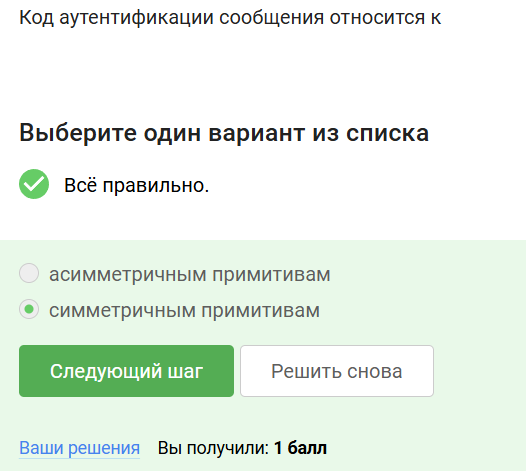

## Ключи Диффи-хеллмэна

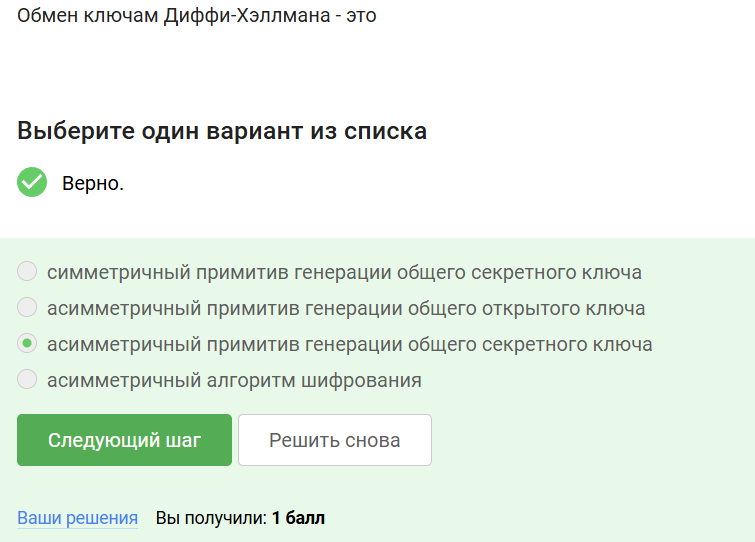

## Электронная цифровая подпись

## Алгоритм верификации 

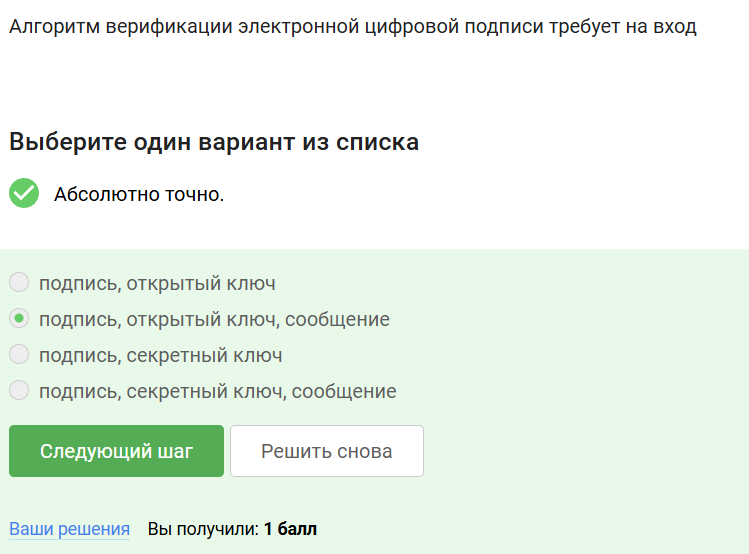

## Не обеспечивает конфиденциальность

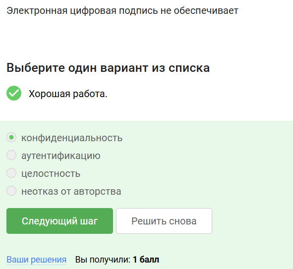

## Усиленная квалифицированная

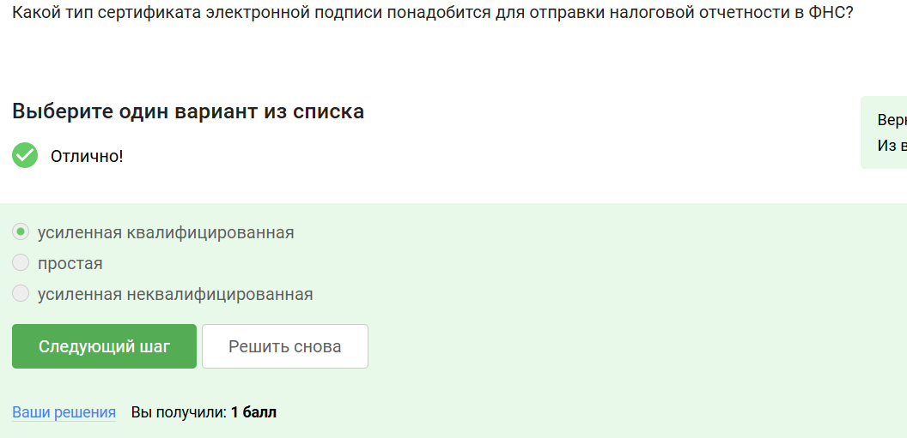

## Организация

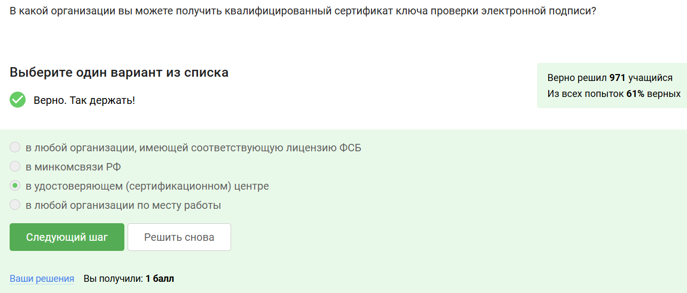

## Платежные системы МИР и Мастер Кард

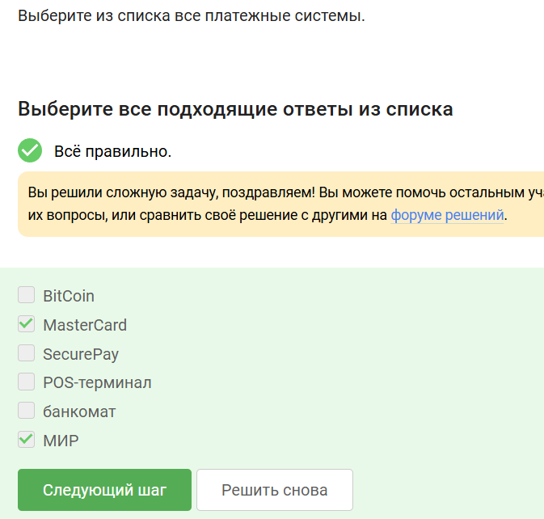

## МФ аутентификация

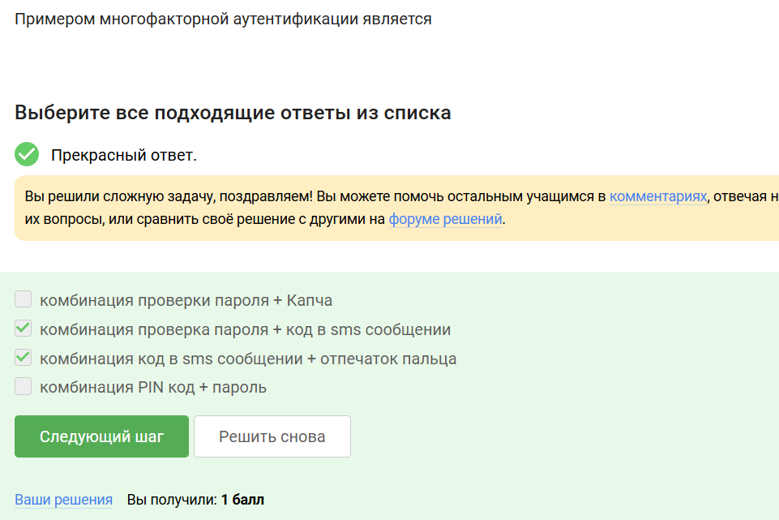

## Где используется мфа

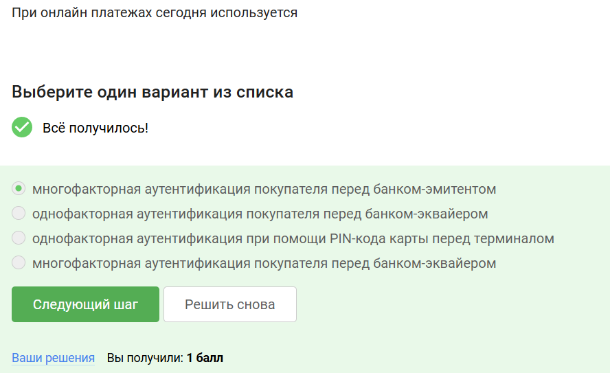

## Сложность нахождения  прообраза

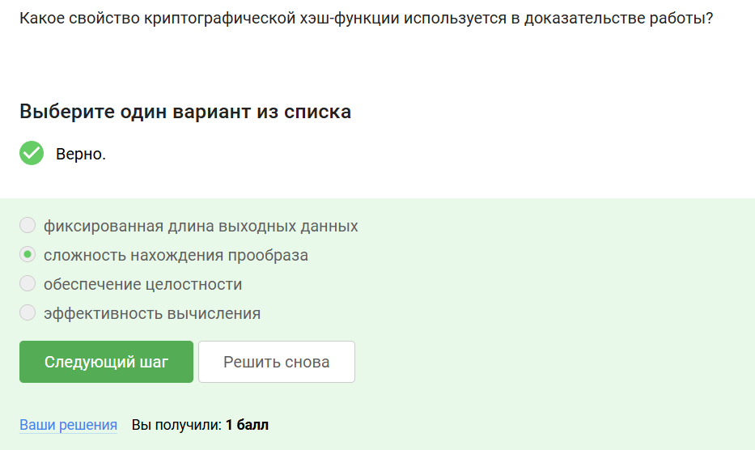

## консенсус

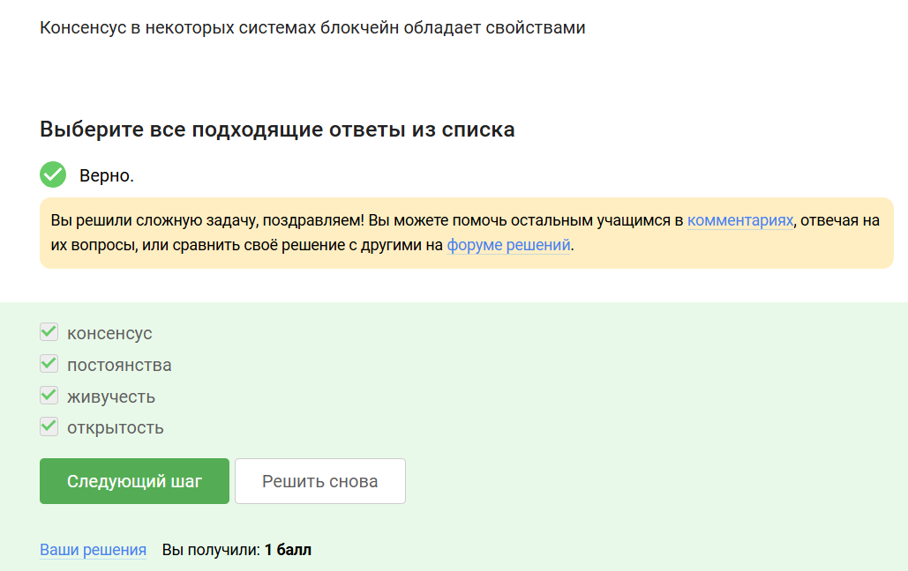

## Выводы

Выволнен третий этап.
